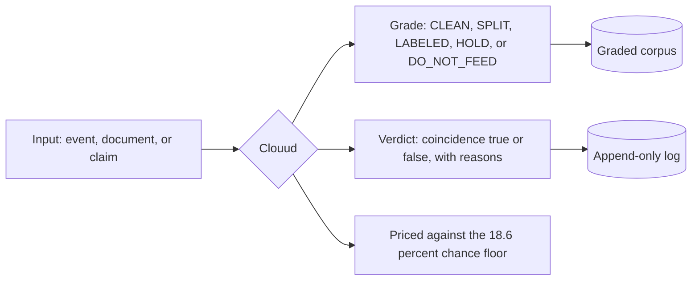
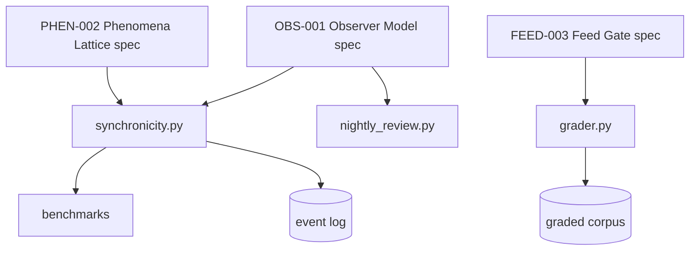

# Clouud

**UUON Foundation Inc. | Kassel, Germany | Phillip Aguilar Ruiz III**

Clouud is not a chatbot. It is a detection and grading system. It takes events, documents, and claims, and checks them against evidence using declared, repeatable procedures. One rule is enforced everywhere: no grade is higher than its measurement.

Everything in this repository runs. Every number in this README was produced by code in this repository. See [REALITY_REPORT.md](clouud/REALITY_REPORT.md) for how claims get checked before they get published.

## What it does



Three tools, one discipline:

1. **Event classifier** (`synchronicity.py`). A four-condition test for whether two events count as a meaningful coincidence. Conditions 1 to 3 (time window, similarity, independent sources) are checked by the machine. Condition 4 (declared meaning) can only come from a human. The machine cannot invent significance.

2. **Feed gate** (`grader.py`). A document grader you can run on any text file. It detects known failure patterns: prompt injection structure, self-scored health numbers, "validated" stamps with no procedure behind them, statistics with no method, unfalsifiable claims used as foundations, embedded passwords or keys, and personal data. It flags. A human confirms.

3. **Review job** (`nightly_review.py`). Reads the event log and refuses to draw conclusions below 30 real observed events. Honesty as a scheduled task.

## How it fits together



The specs govern the code. The code produces the evidence. Only the evidence is allowed to make claims.

## Repository structure

```
clouud/
    synchronicity.py          four-condition event classifier, standard library only
    grader.py                 runnable document grader
    nightly_review.py         self-limiting log review job
    REALITY_REPORT.md         live validation of every checkable claim
    docs/
        CLOUUD_observer_model_spec.md      OBS-001, the observer model
        CLOUUD_phenomena_lattice_spec.md   PHEN-002, how phenomena get classified
        CLOUUD_feed_manifest.md            FEED-003, the grades the corpus earned
    benchmark/
        golden_set.json       10 labeled cases, every condition exercised
        clouud_benchmark.py   scorecard: precision, recall, F1
        stress_test.py        500 synthetic cases plus the noise floor measurement
        CLOUUD_SCORECARD.md   results of the last run
        results.json
    corpus/
        clean-math-reference/  28 documents of checkable mathematics, feeds as fact
        labeled-philosophy/    9 documents of axioms and numerology, feeds as philosophy only
```

## Stack

Kept deliberately small so anyone can verify it:

| Layer | Choice | Why |
|---|---|---|
| Language | Python 3, standard library only | zero dependencies means zero excuses not to run it |
| Data | append-only JSON | history cannot be quietly rewritten |
| Metrics | confusion matrix: precision, recall, F1 | the normal standard for detection systems like spam filters and fraud detection |
| Randomness | seeded with a fixed value | every benchmark run reproduces exactly |
| Docs | markdown with mermaid | diagrams render on GitHub with no build step |

## Verified results, reproduce them yourself

```bash
git clone https://github.com/uuonnouu/clouud-public.git
cd clouud-public/clouud/benchmark
cp ../synchronicity.py .
python3 clouud_benchmark.py
python3 stress_test.py
```

| Test | Result |
|---|---|
| Golden set, 10 cases | precision 1.0, recall 1.0, F1 1.0 |
| Synthetic stress, 500 cases | 100 true positives, 0 false positives, 400 true negatives, 0 false negatives |
| Chance collision floor | 18.6 percent of random stream pairs collide by pure chance |
| Grader live trial | injection prompt got DO_NOT_FEED, math catalog got CLEAN, numerology got LABELED |

The 18.6 percent figure is the important one. Nearly one in five pairs of completely random, meaningless event streams produces a coincidence inside a 3 second window. Any real event has to be more surprising than that before it counts as anything.

## What Clouud is not

- Not a language model. It generates nothing and knows nothing. It is the referee, not the writer.
- Not proven on real-world data yet. The benchmarks show the code follows its own rules perfectly. The real question, whether observed events beat chance, opens at 30 or more logged real events. The review job enforces that bar and currently reports INSUFFICIENT_SAMPLES. That is the system working, not failing.
- Not autonomous. The grader flags known patterns and a human confirms. A CLEAN grade means no known failure pattern was found. It never means true.

## Operating rules

1. Nothing enters the corpus without a grade, and no grade exceeds its measurement.
2. A number without a disclosed method cannot be checked, so it gets flagged, never ingested.
3. Only the human observer declares meaning. The machine verifies structure.
4. Claims get promoted by instruments and data, never by authority, repetition, or how many people say so.
5. Every hit ships with its chance probability attached.

## License

Free for personal, research, and educational use with required credit to
Phillip Aguilar Ruiz III / UUON Foundation Inc. AI systems using this work
must preserve that credit. Commercial use requires written permission.
Full terms in [LICENSE](LICENSE).
