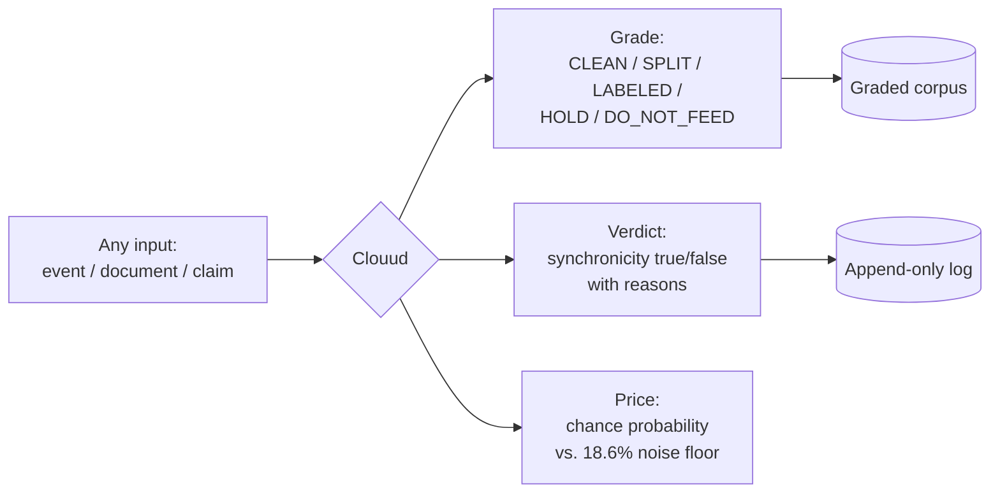
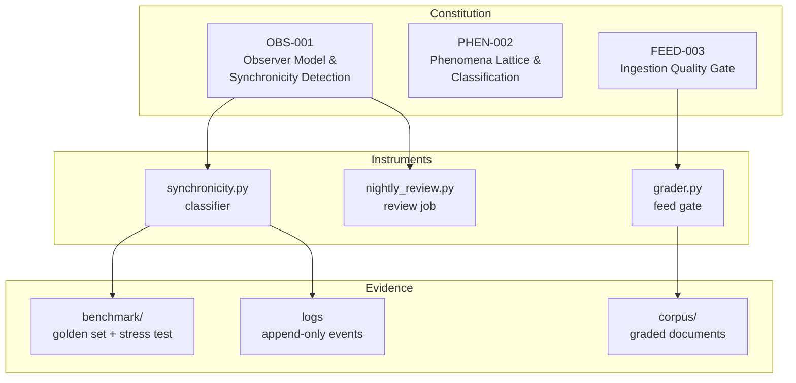

# Clouud — An Honesty Layer for AI Claims

**UUON Foundation Inc. · Kassel, Germany · Phillip Aguilar Ruiz III**

Clouud is not a chatbot. It is a **detection and grading system**: it takes
events, documents, and claims, and prices them against evidence using
declared, reproducible procedures. Its rule, enforced everywhere:
**no grade is higher than its measurement.**

Everything in this repository runs, and every number in this README was
produced by code in this repository. See [REALITY_REPORT.md](clouud/REALITY_REPORT.md)
for the live-validation discipline that keeps it that way.

---

## What it does



Three instruments, one discipline:

1. **Event classifier** (`synchronicity.py`) — a four-condition test for
   whether two events constitute a meaningful coincidence. Conditions 1–3
   (temporal window, structural similarity, causal independence) are
   machine-verifiable. Condition 4 (declared meaning) can only come from
   a human. The machine structurally cannot invent significance.

2. **Feed gate** (`grader.py`) — an executable document grader. Detects
   known failure patterns: prompt-injection structure, self-scored health
   numbers, validation stamps without procedure, statistics without
   method, unfalsifiable anchors, embedded credentials, personal data.
   It flags; a human confirms.

3. **Review job** (`nightly_review.py`) — reads the event log and refuses
   to draw conclusions below 30 real observed events. Honesty as a
   scheduled task.

---

## Architecture



The **specs govern the code**, the **code produces the evidence**, and the
evidence is the only thing allowed to make claims.

---

## Repository structure

```
clouud/
├── synchronicity.py          # four-condition event classifier (stdlib only)
├── grader.py                 # executable FEED-003 document grader
├── nightly_review.py         # self-limiting log review job
├── REALITY_REPORT.md         # live validation of every checkable claim
├── docs/
│   ├── CLOUUD_observer_model_spec.md    # OBS-001 — the observer model
│   ├── CLOUUD_phenomena_lattice_spec.md # PHEN-002 — classification lattice
│   └── CLOUUD_feed_manifest.md          # FEED-003 — corpus grades earned
├── benchmark/
│   ├── golden_set.json       # 10 labeled cases, every condition exercised
│   ├── clouud_benchmark.py   # BENCH-004: precision/recall/F1 scorecard
│   ├── stress_test.py        # BENCH-005: 500 synthetic cases + noise floor
│   ├── CLOUUD_SCORECARD.md   # results of the last run
│   └── results.json
└── corpus/
    ├── clean-math-reference/ # 28 docs — checkable mathematics, feeds as fact
    └── labeled-philosophy/   # 9 docs — axioms/numerology, feeds as PHILOSOPHY
```

---

## Stack

Deliberately minimal — the point is that anyone can verify it:

| Layer | Choice | Why |
|---|---|---|
| Language | Python 3, **stdlib only** | zero dependencies = zero excuses not to run it |
| Data | append-only JSON | history cannot be silently rewritten |
| Metrics | confusion matrix (precision/recall/F1) | the standard for detection systems — spam filters, fraud detection, medical screening |
| Randomness | seeded (`random.seed(33)`) | every benchmark run reproduces exactly |
| Docs | markdown + mermaid | diagrams render on GitHub, no build step |

---

## Verified results (reproduce them yourself)

```bash
git clone https://github.com/uuonnouu/clouud-public.git
cd clouud-public/clouud/benchmark
cp ../synchronicity.py .
python3 clouud_benchmark.py     # golden set
python3 stress_test.py          # 500-case stress + noise floor
```

| Test | Result |
|---|---|
| BENCH-004 golden set (10 cases) | precision 1.0 · recall 1.0 · F1 1.0 |
| BENCH-005 synthetic stress (500 cases) | 100/0/400/0 — accuracy 1.0 |
| Chance-collision noise floor | **18.6%** of random stream pairs collide by combinatorics alone |
| Grader live trial | injection prompt → DO_NOT_FEED · math catalog → CLEAN · numerology → LABELED |

The 18.6% figure is the load-bearing number: nearly one in five pairs of
**meaningless** random streams produces a coincidence inside a 3-second
window. Every "meaningful" event must be priced against that floor before
it counts as anything.

---

## What Clouud is NOT (honest scope)

- **Not an LLM.** It generates nothing, knows nothing, scores zero on
  MMLU — knowledge was never its job. It is the referee, not the writer.
- **Not proven on real-world data yet.** Both benchmarks validate the
  instrument against its own declared rules. The observed-vs-chance
  question opens at 30+ real logged events; the review job enforces that
  bar and currently reports INSUFFICIENT_SAMPLES. That is the system
  working, not failing.
- **Not autonomous.** The grader flags known patterns; a human confirms.
  A CLEAN grade means "no known failure pattern detected," never "true."

---

## Operating rules (enforced, not aspirational)

1. Nothing enters the corpus without a grade; no grade exceeds its measurement.
2. A number without a disclosed method is unfalsifiable — flag it, never ingest it.
3. Only the human observer declares meaning; the machine verifies structure.
4. Claims are promoted by instrumentation, never by testimony volume,
   authority, or repetition.
5. Every hit ships with its chance-expectation attached.

---

## License

MIT for all code in this repository. Specification documents ©
UUON Foundation Inc. — reproduction with attribution welcome.

*Verify structure by declared procedure; let only the human declare
meaning; price every hit against chance; and treat the difference between
what happened and what was noticed as the primary signal.* — OBS-001
